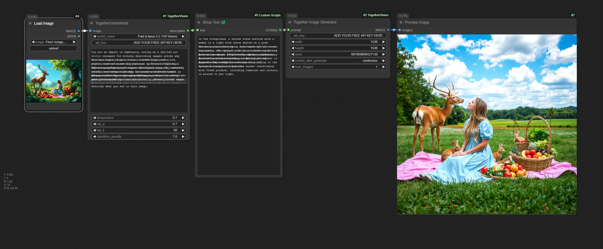

# ComfyUI-TogetherVision

A custom node for ComfyUI that enables image description using Together AI's Vision models. This node allows you to generate detailed descriptions of images using either the paid or free version of Together AI's Llama Vision models.



## Features

🖼️ **Image Description & Text Generation**:
- Generate detailed descriptions of images using state-of-the-art vision models
- Toggle vision processing on/off for flexible usage
- Use as a text-only LLM when vision is disabled
- **New Free Image Generation Node**: Utilize free vision models for image analysis

🤖 **Multiple Models**:
- Paid Version: Llama-3.2-11B-Vision-Instruct-Turbo
- Free Version: Llama-Vision-Free

⚙️ **Customizable Parameters**:
- Temperature control
- Top P sampling
- Top K sampling
- Repetition penalty

🔑 **Flexible API Key Management**:
- Direct input in the node
- Environment variable through .env file

📝 **Custom Prompting**:
- System prompt customization
- User prompt customization

## Getting Started

### 1. Get Together AI API Key
1. Go to [Together AI API Settings](https://api.together.xyz/settings/api-keys)
2. Sign up or log in to your Together AI account
3. Click "Create API Key"
4. Copy your API key for later use

### 2. Installation

1. Clone this repository into your ComfyUI custom_nodes directory:
```bash
cd ComfyUI/custom_nodes
git clone https://github.com/theshubzworld/ComfyUI-TogetherVision.git
```

2. Restart ComfyUI - it will automatically install the required dependencies from requirements.txt

3. Set up your Together AI API key using one of these methods:
   - Option 1: Create a `.env` file in the node directory:
     ```
     TOGETHER_API_KEY=your_api_key_here
     ```
   - Option 2: Input your API key directly in the node

## Usage

1. Add the "Together Vision 🔍" node to your workflow
2. Configure Vision Mode:
   - Enable Vision (Default): Connect an image output to the node's image input
   - Disable Vision: Skip image input for text-only generation

## Rate Limits

### Free Model (Llama-Vision-Free)
- Limited to approximately 100 requests per day
- Rate limit resets every 24 hours

### Paid Model
- Higher rate limits
- Better performance

### Tips to Avoid Rate Limits
1. Cache results for repeated images
2. Use the paid model for production workloads
3. Monitor your API usage through Together AI dashboard
4. Space out your requests when possible

## Operating Modes

### Vision Mode (Default)
- Requires connected image input
- Generates detailed image descriptions
- Full vision + language capabilities

### Text-Only Mode
- No image input required
- Functions as a standard LLM
- Useful for text generation and chat

## Error Handling

The node includes comprehensive error handling and logging:
- API key validation
- Rate limit notifications
- Image processing errors
- API response errors
- Vision mode validation

## Examples

Here are some example prompts you can try:

1. Vision Mode - Detailed Description:
```
Describe this image in detail, including colors, objects, and composition.
```

2. Vision Mode - Technical Analysis:
```
Analyze this image from a technical perspective, including lighting, composition, and photographic techniques.
```

3. Text-Only Mode - Creative Writing:
```
Write a creative story about a magical forest.
```

## Contributing

Contributions are welcome! Please feel free to submit a Pull Request.

## License

This project is licensed under the MIT License - see the [LICENSE](LICENSE) file for details.

## Acknowledgments

- Together AI for providing the Vision API
- ComfyUI community for the framework and support

## Support

If you encounter any issues or have questions:
1. Check the error logs in ComfyUI
2. Ensure your API key is valid
3. Check Together AI's service status
4. Open an issue on GitHub

---

**Note**: This node requires a Together AI account and API key. You can get one at [Together AI's website](https://together.ai).

**Flexible Processing Modes**

- **Image + Text Mode**: When an image is connected, generates descriptions and responses about the image
- **Text-Only Mode**: When no image is connected, functions as a text generation model
- Seamlessly switches between modes based on input connections
